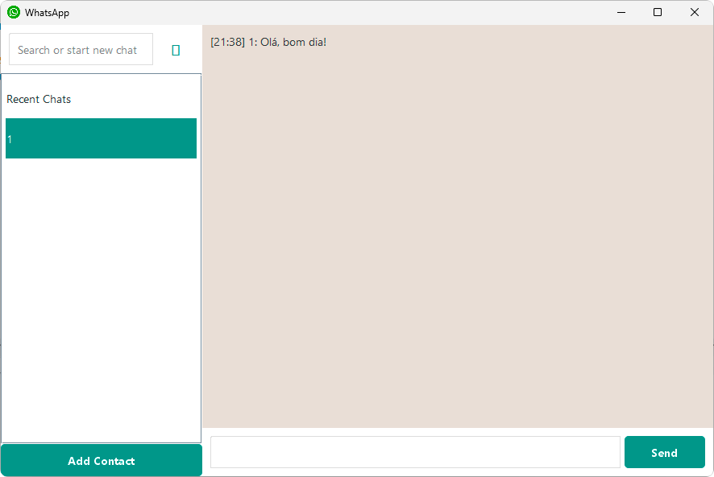

# WhatsApp Clone (Desktop Client)

Este projeto é uma aplicação Desktop desenvolvida em **Java (Swing)** que simula as funcionalidades do **WhatsApp**. Funciona como um cliente que comunica com um servidor backend (provavelmente SpringBoot, conforme mencionado no código original) para troca de mensagens e autenticação.



## 📋 Funcionalidades

- **Autenticação de Utilizador:**
- Login e Registo de novos utilizadores.
- Armazenamento local de credenciais para login automático (`userconfig.properties`).

- **Gestão de Contactos:**
- Adicionar novos contactos através do número de telefone.
- Verificação se o contacto existe no servidor antes de adicionar.
- Lista de "Conversas Recentes" e contactos guardados.

- **Mensagens:**
- Envio de mensagens de texto em tempo real.
- Receção de mensagens (sistema de _polling_ a cada 1 segundo).
- Armazenamento local do histórico de conversas (ficheiros `.properties` na pasta `AppData`).

- **Interface Gráfica (GUI):**
- Interface construída com Java Swing mimetizando o visual do WhatsApp Desktop.
- Campos de texto com _placeholder_ e botões estilizados.

## 🛠️ Tecnologias Utilizadas

- **Linguagem:** Java 8+
- **Interface Gráfica:** Java Swing / AWT
- **Gestão de Dependências:** Maven
- **Bibliotecas:**
- `jackson-databind` (Processamento JSON)
- `gson` (Processamento JSON)

- **Arquitetura:** MVC (Model-View-Controller/Utils)

## ⚙️ Configuração Prévia

**Importante:** A aplicação está configurada para se conectar a um servidor específico. Antes de executar, é provável que precises de alterar o endereço IP do servidor backend.

1. Navega até ao ficheiro: `src/main/java/utils/Constants.java`.
2. Localiza a linha `ROOT_URL`:

```java
// Altera o IP '192.168.1.10' para o IP da tua máquina ou servidor backend
public static final String ROOT_URL = "http://192.168.1.10:8080";
```

3. Certifica-te de que o servidor backend está a correr e acessível neste endereço.

## 🚀 Como Executar

### Pré-requisitos

- Java JDK 8 ou superior instalado.
- Maven instalado.

### Passos para Compilar e Rodar

1. **Clonar o repositório** (se ainda não o fizeste).
2. **Compilar o projeto** usando o Maven:

```bash
mvn clean package
```

Isto irá gerar um ficheiro `.jar` na pasta `target` (ex: `whatsapp-app-1.0-SNAPSHOT-jar-with-dependencies.jar`). 3. **Executar a aplicação:**
Podes executar através da tua IDE (executando a classe `view.Main`) ou via linha de comandos:

```bash
java -jar target/whatsapp-app-1.0-SNAPSHOT-jar-with-dependencies.jar
```

## 📂 Estrutura do Projeto

- **`model`**: Classes de dados (`User`, `Message`, `ContactVerificationRequest`).
- **`view`**: Interface gráfica (`LoginJFrame`, `PrincipalJFrame`, `ChatWindow`) e componentes visuais.
- `components`: Componentes personalizados como `PlaceholderTextField`.

- **`network`**: Lógica de comunicação HTTP com a API (`HttpClientUtils`).
- **`utils`**: Utilitários para gestão de ficheiros, constantes, preferências do utilizador e carregamento de imagens.

## 💾 Armazenamento de Dados Local

A aplicação cria uma pasta local para persistir dados (como login e histórico), localizada em:

- **Windows:** `%APPDATA%\WhatsApp`
- **Estrutura:**
- `userconfig.properties`: Credenciais do utilizador.
- `contacts.properties`: Lista de contactos.
- `messages/`: Pasta contendo o histórico de conversas por contacto.

## 📝 Notas do Desenvolvedor

- A aplicação utiliza _Long Polling_ (timer de 1 segundo) para verificar novas mensagens, o que é uma solução simples para atualizações em "tempo real".
- As passwords são atualmente enviadas/guardadas conforme introduzidas (recomenda-se implementação de hash/segurança para produção).

---

_Desenvolvido como um projeto de estudo para recriar a experiência do WhatsApp em Java._
